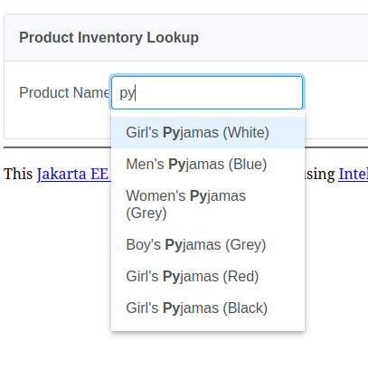
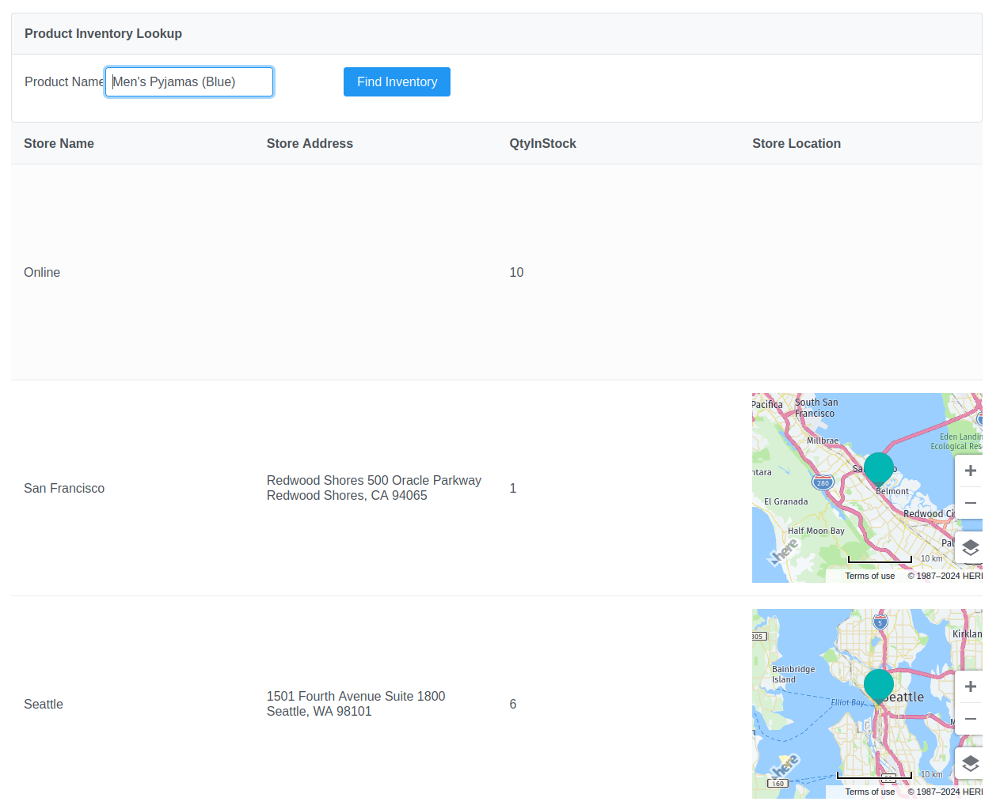

= DMIT2015 Assignment 4 - Jakarta Persistence (Database First), JPQL, and AutoComplete
:source-highlighter: rouge
:max-width: 90%

== OBJECTIVE
Upon completion of this assignment, you will have demonstrated the ability to:

- Configure the Jakarta Persistence environment to connect to an Oracle Database.
- Generate Jakarta Persistence entity classes for a database schema.
- Write a JPQL (Java Persistence Query Language) statement to perform pattern matching on string values.
- Write a JPQL (Java Persistence Query Language) statement to perform an eager fetch of associated entities.
- Build a web page to search for product inventory using the PrimeFaces AutoComplete component.

== PROBLEM DESCRIPTION
You are the Junior Software Developer for an organization where you have been assigned the task to create an intranet Java web application 
for customers and employees to search for product inventory for the Oracle *CO (Customer Orders)* sample database schema.
The https://docs.oracle.com/en/database/oracle/oracle-database/23/comsc/schema-diagrams.html[*Customer Orders* Schema Diagram] describes the relationships between the tables.
The https://docs.oracle.com/en/database/oracle/oracle-database/23/comsc/co-table-desciptions.html#GUID-178FFB51-5552-40EE-9535-EDD481EAD38D[*CO* Schema Table Descriptions] describes the columns of each table. 

To search for product inventory the user will use a AutoComplete field to enter the product name as shown below.

The search results will show the Store Name, Store Name, Qty In Stock (productInventory), and optionally a map to the store location.

== Oracle Database 23c Free Version Docker Container
The VM contains a Docker container for Oracle Database 23ai Free Version.
To use the Oracle Database you must be manually started each time you login by opening a Terminal window and typing the command `docker start dmit2015-oracle-free`. You can use teh command `docker logs dmit2015-oracle-free` to check the log files from the docker container.

=== Setting up a Oracle Database 23c docker container on a Windows host machine
To install Oracle Database 23c on a Windows host machine:

* Install https://docs.docker.com/desktop/install/windows-install/[Docker Desktop on Windows]
* Create a directory on your c: drive named *C:\jdk\Oracle*
* Copy from the VM in the Downloads folder the files https://download.oracle.com/otn_software/java/sqldeveloper/sqlcl-23.4.0.023.2321.zip[sqlcl-23.4.0.023.2321.zip] and https://www.oracle.com/database/sqldeveloper/technologies/download/#license-lightbox[sqldeveloper-23.1.1.345.2114-no-jre.zip]
* Unzip both files to C:\jdk\Oracle folder
* Open a Windows Terminal and type in the following commands one at a time

[source, console]
----
docker pull container-registry.oracle.com/database/free

docker run -d --name dmit2015-oracle-free -p 1521:1521 -e ORACLE_PWD=Password2015 container-registry.oracle.com/database/free

C:\jdk\Oracle\sqlcl\bin\sql.exe sys/Password2015@localhost:1521/FREEPDB1 as sysdba

  CREATE USER user2015 IDENTIFIED BY Password2015;

  GRANT CONNECT, RESOURCE, DBA TO user2015;

  GRANT CREATE SESSION TO user2015;

  GRANT GRANT ANY PRIVILEGE TO user2015;

  quit

cd C:\jdk\Oracle

git clone https://github.com/oracle/db-sample-schemas.git

cd C:\jdk\Oracle\db-sample-schemas

C:\jdk\Oracle\sqlcl\bin\sql.exe user2015/Password2015@localhost:1521/FREEPDB1

@human_resources/hr_install.sql

quit

C:\jdk\Oracle\sqlcl\bin\sql.exe user2015/Password2015@localhost:1521/FREEPDB1

@customer_orders/co_install.sql

quit

----

== GIT REPOSITORY SETUP
. The team lead member will create a new team on the GitHub group assignment.
. The other team members will join the existing team on the GitHub group assignment.
. The team lead member will clone the git repository to the *~/IdeaProjects/dmit2015-1233-assignment04* folder from IntelliJ IDEA.

== PROJECT SETUP
. The team lead will create the project.
. Open IntelliJ IDEA and create a new project using the *Jakarta EE* module and change following settings:
 .. Name: `dmit2015-assignment04-yourTeamName`
 .. Location: `~/IdeaProjects/dmit2015-1233-assignment04`
 .. Template: `Web application`
 .. Application server: `<No appliation server>`  
 .. Group: `dmit2015`
 .. Artifact: `assignment04-yourTeamName`
. Click *Next*
. Select the following specifications:
 .. Web Profile (10.0.0)
  Click *Create*

. Make the following changes to `pom.xml`
* Change the element value for both `maven.compiler.target` and `maven.compiler.source` to `*21*`.
* Change the element value for `junit.version` to `*5.10.2*`.

poml.xml
[source, xml]
----
<!-- MicroProfile Config is for reading configuration information from src/main/resources/META-INF/microprofile-config.properties file. -->
<dependency>
    <groupId>org.eclipse.microprofile.config</groupId>
    <artifactId>microprofile-config-api</artifactId>
    <version>3.1</version>
</dependency>

<!-- DataFaker is for creating fake data using a provider -->
<dependency>
    <groupId>net.datafaker</groupId>
    <artifactId>datafaker</artifactId>
    <version>2.2.2</version>
</dependency>

<dependency>
    <groupId>org.projectlombok</groupId>
    <artifactId>lombok</artifactId>
    <version>1.18.32</version>
    <scope>provided</scope>
</dependency>

<dependency>
    <groupId>org.hibernate.orm</groupId>
    <artifactId>hibernate-spatial</artifactId>
    <version>6.5.2.Final</version>
</dependency>

<dependency>
    <groupId>com.oracle.database.jdbc</groupId>
    <artifactId>ojdbc11</artifactId>
    <version>23.4.0.24.05</version>
</dependency>

<!-- Additional tools to use with Jakarta Faces -->
<dependency>
    <groupId>org.primefaces</groupId>
    <artifactId>primefaces</artifactId>
    <version>14.0.0</version>
    <classifier>jakarta</classifier>
</dependency>
<dependency>
    <groupId>org.webjars.npm</groupId>
    <artifactId>primeflex</artifactId>
    <version>3.3.1</version>
</dependency>
<dependency>
    <groupId>org.omnifaces</groupId>
    <artifactId>omnifaces</artifactId>
    <version>4.4.1</version>
</dependency>

<!-- Arquillian allows you to test enterprise code such as EJBs and Transactional(JTA)
            JPA from JUnit/TestNG -->
<dependency>
    <groupId>org.jboss.shrinkwrap.resolver</groupId>
    <artifactId>shrinkwrap-resolver-impl-maven</artifactId>
    <version>3.3.0</version>
    <scope>test</scope>
</dependency>
<dependency>
    <groupId>org.jboss.arquillian.junit5</groupId>
    <artifactId>arquillian-junit5-container</artifactId>
    <version>1.8.0.Final</version>
    <scope>test</scope>
</dependency>
<dependency>
    <groupId>org.jboss.arquillian.protocol</groupId>
    <artifactId>arquillian-protocol-servlet-jakarta</artifactId>
    <version>1.8.0.Final</version>
    <scope>test</scope>
</dependency>
<dependency>
    <groupId>org.wildfly.arquillian</groupId>
    <artifactId>wildfly-arquillian-container-managed</artifactId>
    <version>5.1.0.Beta2</version>
    <scope>test</scope>
</dependency>

<dependency>
    <groupId>org.slf4j</groupId>
    <artifactId>slf4j-api</artifactId>
    <version>2.0.13</version>
</dependency>
<dependency>
    <groupId>org.slf4j</groupId>
    <artifactId>slf4j-simple</artifactId>
    <version>2.0.13</version>
</dependency>

<dependency>
    <groupId>org.junit.jupiter</groupId>
    <artifactId>junit-jupiter-params</artifactId>
    <version>${junit.version}</version>
    <scope>test</scope>
</dependency>

<dependency>
    <groupId>org.assertj</groupId>
    <artifactId>assertj-core</artifactId>
    <version>3.26.0</version>
    <scope>test</scope>
</dependency>

<!-- Dependency for Functional UI testing using Selenium WebDriver -->
<dependency>
    <groupId>org.seleniumhq.selenium</groupId>
    <artifactId>selenium-java</artifactId>
    <version>4.21.0</version>
</dependency>
<dependency>
    <groupId>io.github.bonigarcia</groupId>
    <artifactId>webdrivermanager</artifactId>
    <version>5.8.0</version>
    <scope>test</scope>
</dependency>
<dependency>
    <groupId>io.github.bonigarcia</groupId>
    <artifactId>selenium-jupiter</artifactId>
    <version>5.1.0</version>
    <scope>test</scope>
</dependency>

<!-- For PrimeFaces DataExporter PDF and Excel -->
<dependency>
    <groupId>com.github.librepdf</groupId>
    <artifactId>openpdf</artifactId>
    <version>2.0.2</version>
</dependency>
<dependency>
    <groupId>org.apache.poi</groupId>
    <artifactId>poi</artifactId>
    <version>5.2.5</version>
</dependency>
<dependency>
    <groupId>org.apache.poi</groupId>
    <artifactId>poi-ooxml</artifactId>
    <version>5.2.5</version>
</dependency>
----

* Add the following dependencies to the `<plugins>` element.

poml.xml
[source, xml]
----
<!-- Plugin to build a bootable JAR for WildFly -->
<plugin>
    <!-- https://docs.wildfly.org/bootablejar/#wildfly_jar_dev_mode -->
    <!-- mvn wildfly-jar:dev-watch -->
    <groupId>org.wildfly.plugins</groupId>
    <artifactId>wildfly-jar-maven-plugin</artifactId>
    <version>11.0.2.Final</version>
    <configuration>
        <feature-packs>
            <feature-pack>
                <location>wildfly@maven(org.jboss.universe:community-universe)#32.0.1.Final</location>
            </feature-pack>
        </feature-packs>
        <layers>
            <!-- https://docs.wildfly.org/32/Bootable_Guide.html#wildfly_layers -->
            <layer>cloud-server</layer> <!-- includes ee-security -->
            <layer>jsf</layer>
        </layers>
        <excluded-layers>
            <layer>deployment-scanner</layer>
        </excluded-layers>
        <plugin-options>
            <jboss-fork-embedded>true</jboss-fork-embedded>
        </plugin-options>
        <!-- https://docs.wildfly.org/bootablejar/#wildfly_jar_enabling_debug -->
        <jvmArguments>
            <!-- https://www.jetbrains.com/help/idea/attaching-to-local-process.html#attach-to-local -->
            <!-- To attach a debugger to the running server from IntelliJ IDEA
                1. From the main menu, choose `Run | Attach to Process`
                2. IntelliJ IDEA will show the list of running local processes. Select the process with the `xxx-bootable.jar` name to attach to.
            -->
            <arg>-agentlib:jdwp=transport=dt_socket,address=8787,server=y,suspend=n</arg>
        </jvmArguments>
        <!-- Build a bootable JAR for cloud environment. -->
        <cloud />
        <!-- Increase timeout 3x from 60 seconds to 180 seconds. -->
        <timeout>180</timeout>
    </configuration>
    <executions>
        <execution>
            <goals>
                <goal>package</goal>
            </goals>
        </execution>
    </executions>
</plugin>

<!-- Plugin to run unit tests-->
<!-- mvn test -->
<plugin>
    <groupId>org.apache.maven.plugins</groupId>
    <artifactId>maven-surefire-plugin</artifactId>
    <version>3.2.5</version>
</plugin>

<!-- Plugin to run functional tests -->
<!--  mvn failsafe:integration-test -->
<plugin>
    <groupId>org.apache.maven.plugins</groupId>
    <artifactId>maven-failsafe-plugin</artifactId>
    <version>3.2.5</version>
</plugin>

----

[start=5]
. Create the following Java packages
.. `common.config` for Java configuraton classes such as `ApplicationConfig.java`
.. `dmit2015.entity` for Java classes that is mapped to a database
.. `dmit2015.persistence` for Java classes to manage entity classes
.. `dmit2015.faces` for Jakarta Faces backing bean classes

. In the Java package `dmit2015.config`, create a new *DMIT2015 Jakarta Persistence ApplicationConfig* file then configure the JTA data source definition for the *CO* Oracle Database schema.

. Navigate to the `src/main/resources/META-INF` folder and delete the existing *persistence.xml* file. In the `src/main/resources/META-INF` create a new *DMIT2015 Jakarta Persistence persistence.xml* file then configure the persistence unit for the *CO* Oracle Database schema.
.. Open *persistence.xml* file and add the following `<property>` to the `<properties>` element to resolve issues with `java.time.Instant` mapped data type.
+
[source, xml]
----
<property name="hibernate.type.preferred_instant_jdbc_type" value="TIMESTAMP"/>
----
+
. In IntelliJ, open the *Database* window and add a new Data Source to the Oracle Database CO schema.

. Commit and push your project to your GitHub repository.

== REQUIREMENTS
. From the Database window in IntelliJ, navigate to the tables folder of the OR schema. Right-mouse click on tables then select *Create JPA Entities from DB*
.. Set the *Entity Package* field to `dmit2015.entity`
.. Check the *Tables* option to select all tables.
... Select each table and check the *References* option to generate entity associations.
.. Verify entity classes for `Customer`, `Inventory`, `Order`, `OrderItem`, `OrderItemId, `Product`, `Shipment` and `Store`.
. In the Java package `dmit2015.persistence`, use the *DMIT2015 Jakarta Persistence CRUD Repository* file template to create Jakarta Persistence repository for the *Product* entity class.
.. Add a method to search for products by a product name pattern such as:
+
[source, java]
----
public List<Product> findProductsByName(String namePattern) {
    // TODO: Write and execute a JPQL statement to return a list of Product matching the partial namePattern
}
----
+
.. Add a method to search for products by a product name pattern such as:
+
[source, java]
----
public List<Inventory> findInventoryByProductId(Long productId) {
    // TODO: Write and execute a JPQL statement to return a list of Inventory matching the productId and fetch the store associated with each inventory.
}
----
+
. Create and code the Faces web pages and its supporting Java classes to search for product inventory by a selected product.
.. The Faces page will use a http://www.primefaces.org:8080/showcase/ui/input/autoComplete.xhtml?jfwid=b43d8[PrimeFaces AutoComplete] component for search and select the product.
.. image::./images/assignment04_autocomplete.png[Auto Complete]

.. Clicking on the http://www.primefaces.org:8080/showcase/ui/button/commandButton.xhtml?jfwid=b43d8[PrimeFaces CommandButton] will display a list that shows the *Store Name*, *Store Address*, and *Qty In Stock* for the selected product.

. Modify `src/main/webapp/WEB-INF/faces-templates/layout.xhtml` and add a link to the web page to search for product inventory.

. Add a home page to your web application. 

. Run the maven plugin:goal *wildfly-jar:dev-watch* and verify that your project is Deployed.

. Open a web browser and test your Faces web pages to search for product inventory.

. OPTIONAL CHALLENGE: Add a column in your search results table to display a map with a marker to the store  location. You can use 
https://www.here.com/docs/bundle/maps-api-for-javascript-developer-guide/page/topics/typescript.html[HERE Maps API for JavaScript] to display a map using the store value for *latitude* and *longitude*. You can also add a 
https://developer.here.com/documentation/examples/maps-js/markers/markers-on-the-map[Marker on the Map] to higlight the store location on the map.

== CODING REQUIREMENTS
* Java packages and classes must follow https://www.oracle.com/java/technologies/javase/codeconventions-namingconventions.html[Java Naming Conventions] (*20%* deduction if you do not follow this requirement)
* All Java source files must include javadoc comments before the class with a description of the class, `@author` with your full name, and `@version` with the last date modifed. (*10%* deduction if you do not follow this requirement)

== MARKING GUIDE

[cols="4,1"]
|===
|Demonstration Requirement|Mark

| Generated entity classes for `Customer`, `Inventory`, `Order`, `OrderItem`, `OrderItemId, `Product`, `Shipment` and `Store`.
| 1

| Demonstrate project is deployed and home page is accessible.
| 1

| Demonstrate using PrimeFaces AutoComplete to search for a product by partial name.

1 - Typing the AutoComplete field shows matching results.

2 - Selecting a matching result completes the AutoComplete field.

3 - A Faces Converter is implemented to track the object selected.

| 3

| Demonstrate displaying a list of search results.

1 - QtyInStock (productInventory) column shows correct value.

2 - Store Name and Store Address columns shows correct values.

| 2

|===

== SUBMISSION REQUIREMENTS
* Commit and push your project to your git repository before the due date.
* Demonstrate in person during schedule class time the demonstration requirements on or before the first class after the due date.

== Resources
* https://jakarta.ee/specifications/persistence/3.1/jakarta-persistence-spec-3.1.html[Jakarta Persistence]
* http://www.primefaces.org:8080/showcase/ui/input/autoComplete.xhtml?jfwid=b43d8[PrimeFaces AutoComplete]
* https://www.here.com/docs/bundle/maps-api-for-javascript-developer-guide/page/topics/typescript.html[HERE Maps API for JavaScript]